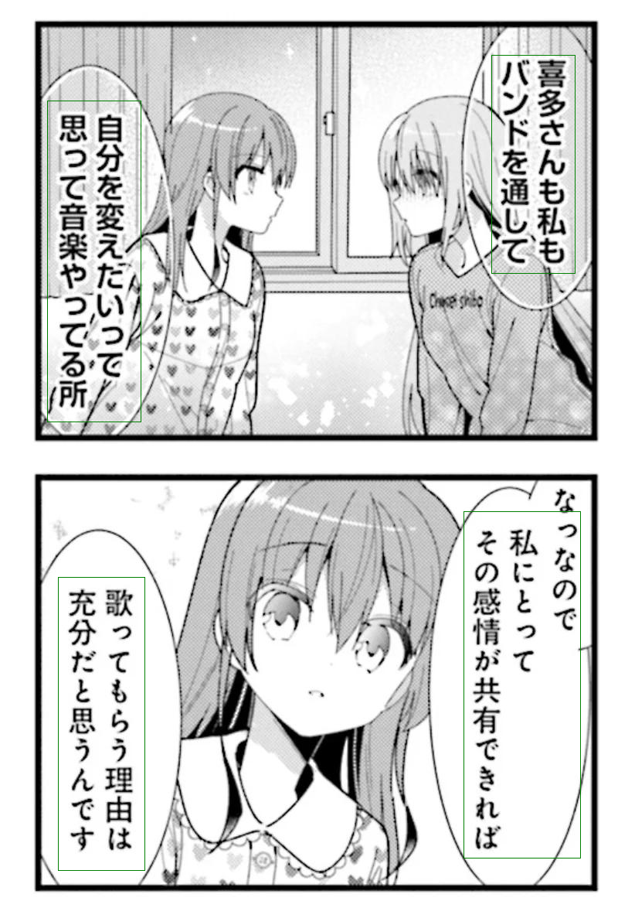
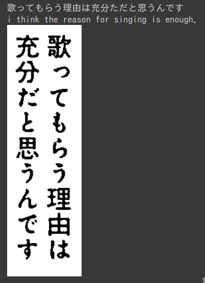
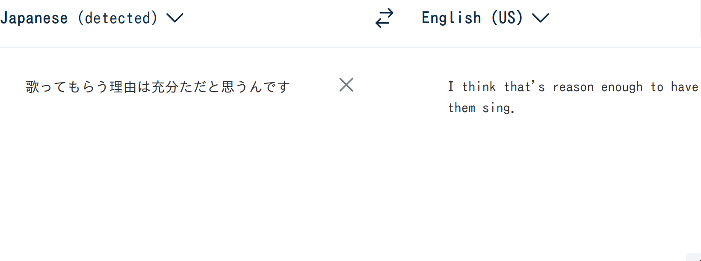

# Manga Bubbles

This repository is a project for automatic translation of Manga pages. It uses 3 successives Machine-learning models to achieves its task, following these steps :

1. Use _YOLOv8_ to detect texts in a page in order to isolate them from the rest of the page
2. Use _Tesseract_ to apply OCR on the cropped texts
3. Translate japanese texts to english using _mBART_

The project was primarly designed for this task but you can use each model separately for your own tasks. Each folder is associated to one model (3 folders for 3 models) so you can finetune them separately. Just go to the folder you want, modify its config.ini then execute the bash scripts that has the name of its corresponding folder (the README in each folder will guide you)



<div>
    
    
</div>

### Requirements

You will need python3 and pip to use this repository. You can install all the requirements with this command :

```pip install -r requirements.txt```

### Execute

To execute this repository, you can use the bash script :

```chmod a+x manga_bubbles.sh && ./manga_bubbles```

The script will guide you whether you want to finetune the different models further, then will execute the python file _manga_bubbles.py_

The repository comes with an exemple image _bocchi.jpg_ but you can also add you own image to this repo, then modify the config.ini file to apply the pipeline on it (you only have to change the variable _image_ to the name of you image)

### Jupyter Notebook

You can also follow the Jupyter Notebook in _manga\_bubbles.ipynb_.

### Deployment and usage

You can deploy the models on your server with Docker by executing the Dockerfile in this [repository](https://github.com/Gozea/manga2text-deploy)

You can also use it through a firefox extension with the code [here](https://github.com/Gozea/manga2text-extension)
